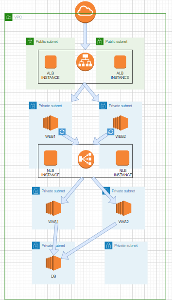
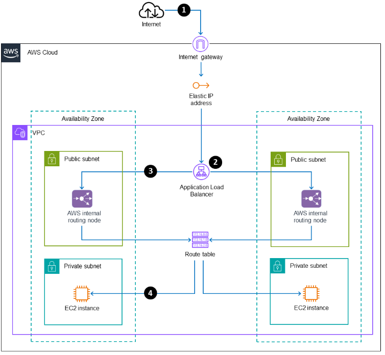

# 3-Tier-Architecture

> 정의 : 정형화된 3개의 물리적/논리적 티어로 구성된 어플리케이션 아키텍처
>
> 3개의 티어로 구성
>
> 	1. Presentation Tier : 사용자와 직접 소통하는 티어로 주로 HTML/CSS 와 같은 유저를 위한 UI 로 구성
> 	1. Application Tier : 실제 로직을 처리하는 티어로 다양한 프로그래밍 언어 등으로 구성
> 	1. Data Tier : 데이터를 저장하는 티어로 주로 데이터베이스 혹은 데이터를 처리하는 저장 공간으로 구성


### 아키텍처



### 장점/ 단점

* 장점
  * 각 계층이 분리되어 업무 분담이 가능, 계층별 서로 다른 팀이 동시에 개발 가능
  * 서버를 계층별 독립적으로 존재, 높은 확장성
  * 한 계층에서 일어난 장애는 다른 계층에 영향을 미치지 않는 높은 가용성
  * 계층별 순차적인 접근, 보안적 측면이 좋음
* 단점
  * 설계 및 구축이 어렵다..... 비용도 많이 발생한다.....


### VPC & 서브넷 설정

네트워크 대역 / 서브넷 대역 주의하여 설정

1개의 VPC, (private web /was /db) , (public bastion, nat) 총 8개 서브넷


### 인터넷 게이트웨이 설정

퍼블릭 서브넷은 인터넷게이트웨이를 통해 외부망과 연결된 서브넷

VPC 와 연결


### 라우팅 테이블 설정

트래픽이 전달될 수 있도록 설정

아웃바운드 대상 - 목적지와 타겟 설정 (인터넷 게이트웨이로 대상 설정)

서브넷 연결 - 퍼블릭 서브넷과 연결 - Nat Gateway 연결 설정


### NAT 게이트웨이 설정

**퍼블릭**으로 설정

별도의 **라우팅 테이블 설정** - 만들어 놓은 모든 프라이빗 서브넷과 연결


### 탄력적 IP 설정 - NAT 게이트웨이

외부와 통신하기 위한 IP로, 인스턴스에서 외부와 통신을 할 때 사용하는 출발지 IP 로 지정


### Bastion Host 생성

> 중계 서버 역할 : Bastion Host는 외부 사용자가 내부 네트워크에 접근할 수 있도록 중간에서 접속을 중재하는 서버


1. 키페어 생성 - RSA
2. 네트워크 설정 
   1. 인바운드 - SSH 설정
   2. 아웃바운드 - 다른 인스턴스 추가
3. 탄력적 IP 주소 할당 - 인스턴스
   1. VPC가 IGW를 가지고 있기에 설정 가능




### SSH 접속 - WEB 생성 및 접속

```
putty

hostname 입력 후, port 22 SSH load

vi .pem
chmod 400 .pem
ssh -i .pem ec2-user@ 'address'
```


### ALB 생성 및 설정

> 트래픽 흐름
>
> 1. 외부 -> ALB Elastic IP -> Internet GW -> Routing Table -> ELB Subnet -> Routing Node -> ALB Rule & Routing -> Instance


2개의 WEB 서브넷

보안그룹 인바운드  80, 443 HTTP / 아웃바운드 WEB 보안그룹 node

타겟 그룹 생성 후 지정

apr, apr-util, pcre 설치

```
sudo yum update -y
sudo yum install -y gcc gcc-c++ expat-devel.x86_64 pcre-devel

cd /usr/local/src/
sudo wget https://sourceforge.net/projects/pcre/files/pcre/8.44/pcre-8.44.tar.gz
sudo tar zxvf pcre-8.44.tar.gz
cd pcre-8.44
sudo ./configure --prefix=/usr/local/pcre
sudo make install

cd /usr/local/src

# apr-util & apr & httpd 소스 파일 다운로드. 소스 파일은 아래 주소에서 링크 복사하자!
# https://httpd.apache.org/download.cgi
# https://apr.apache.org/download.cgi

sudo wget https://dlcdn.apache.org/httpd/httpd-2.4.56.tar.gz
sudo wget https://dlcdn.apache.org//apr/apr-1.7.2.tar.gz
sudo wget https://dlcdn.apache.org//apr/apr-util-1.6.3.tar.gz

# 압축 해제
sudo tar zxvf httpd-2.4.56.tar.gz
sudo tar zxvf apr-1.7.2.tar.gz
sudo tar zxvf apr-util-1.6.3.tar.gz

# apr & apr-util 파일을 httpd 파일 안으로 이동
sudo mv apr-1.7.2 ./httpd-2.4.56/srclib/apr
sudo mv apr-util-1.6.3 ./httpd-2.4.56/srclib/apr-util

# httpd 폴더로 이동
cd httpd-2.4.56/

# 컴파일 파일 생성
sudo ./configure \
--prefix=/usr/local/apache \
--with-included-apr \
--with-pcre=/usr/local/pcre

# 컴파일
sudo make install
```


### APACHE 설정 & 서비스 등록

```
sudo vi /usr/local/apache/conf/httpd.conf
ServerName localhost:80

httpd.conf 파일에 들어가서 서버 이름을 localhost로 지정

sudo vi /usr/lib/systemd/system/apache.service
# 아래 내용 붙여넣기
[Unit]
Description=apache
After=network.target syslog.target


[Service]
Type=forking
User=root
Group=root


ExecStart=/usr/local/apache/bin/apachectl start
ExecStop=/usr/local/apache/bin/apachectl stop


Umask=007
RestartSec=10
Restart=always


[Install]
WantedBy=multi-user.target

sudo systemctl daemon-reload
sudo systemctl enable apache
sudo systemctl start apache

index.html은 /usr/local/apache/htdocs 경로에 위치
```

타겟 그룹에서 헬스체크가 되는지 확인


### WAS & NLB

```
sudo su - # root 계정으로 전환

sudo yum install java-1.8* # 자바 설치

# 소스 파일 다운로드
sudo wget https://dlcdn.apache.org/tomcat/tomcat-8/v8.5.87/bin/apache-tomcat-8.5.87.tar.gz

# 다운로드된 파일 압축해제
sudo tar xvfz apache-tomcat-8.5.87.tar.gz

# tomcat 폴더 생성 & 이동
sudo mv apache-tomcat-8.5.87 /usr/local/tomcat8.5

# sudo vi /etc/profile

export JAVA_HOME=/usr/lib/jvm/java-1.8.0-amazon-corretto.x86_64
export CATALINA_HOME=/usr/local/tomcat8.5

export CLASSPATH=.:$JAVA_HOME/jre/lib/ext:$JAVA_HOME/lib/tools.jar:$CATALINA_HOME/lib/jsp-api.jar:$CATALINA_HOME/lib/servlet-api.jar
export JDK_HOME=$JAVA_HOME

export PATH=$PATH:$JAVA_HOME/bin:$CATALINA_HOME/bin

source /etc/profile

[ec2-user@ip-10-0-118-87 ~]$ echo $JAVA_HOME
/usr/lib/jvm/java-1.8.0-amazon-corretto.x86_64
[ec2-user@ip-10-0-118-87 ~]$ echo $CATALINA_HOME
/usr/local/tomcat8.5

[server.xml]
# sudo vi /usr/local/tomcat8.5/conf/server.xml

# 이 부분을 수정하면 된다
<Connector port="8080" protocol="HTTP/1.1"
               connectionTimeout="20000"
               redirectPort="8443" />

# URIEncoding="UTF-8"을 추가해주자
<Connector port="8080" protocol="HTTP/1.1"
               URIEncoding="UTF-8"
               connectionTimeout="20000"
               redirectPort="8443" />

```


### Tomcat 실행 & 서비스 등록

```
# 권한 부여
cd /usr/local/tomcat8.5/bin
chmod +x startup.sh
chmod +x shutdown.sh

# Tomcat 시작
/usr/local/tomcat8.5/bin/startup.sh

# 중지 명령은 아래와 같다
/usr/local/tomcat8.5/bin/shutdown.sh

# vi /usr/lib/systemd/system/tomcat.service

[Unit] 
Description=tomcat 8.5
After=network.target syslog.target

[Service]
Type=forking

User=root
Group=root

# 실행 파일 경로
ExecStart=/usr/local/tomcat8.5/bin/startup.sh

# 중지 파일 경로
ExecStop=/usr/local/tomcat8.5/bin/shutdown.sh

# 디렉토리 권한 770 && 새로운 파일 권한 660
UMask=0007

[Install]
WantedBy=multi-user.target

systemctl daemon-reload
systemctl enable tomcat
systemctl start tomcat

[Tomcat index.jsp]
sudo su -
cd /usr/local/tomcat8.5/webapps/ROOT
vi index.jsp

# 아래 내용으로 수정. 보여지는 내용을 WAS 서버 구분과 현재 날짜로 설정
<%@ page contentType="text/html; charset=UTF-8"%>
<html>
      <head><title>This is WAS1</title></head>
      <body>
          WAS1 TEST
          TIME IS <%= new java.util.Date()%>
      </body>
</html>

systemctl restart tomcat
curl http://localhost:8080
```


### NLB 생성 및 설정

내부에서 동작하는 로드밸런서

대상그룹 - 8080

대상 - WAS instance 2개

리스너 설정

보안 그룹 X

```
sudo systemctl restart apache
```


### DB 보안그룹 및 인스턴스 생성

보안그룹 인바운드 3306, 22


### DB 설치

```
sudo groupadd mysql
sudo useradd -g mysql -s /bin/bash -m mysql

# MYSQL 계정을 생성
sudo yum install -y --allowerasing gcc gcc-c++ openssl curl autoconf ncurses-devel bison zlib curl bzip2-devel rpcgen libtirpc libtirpc-devel cmake

# 필요 패키지 생성
wget https://dev.mysql.com/get/Downloads/MySQL-5.7/mysql-boost-5.7.23.tar.gz
tar xvf mysql-boost-5.7.23.tar.gz
cd mysql-5.7.23

# mysql 소스 파일을 다운 받아 압축 해제 후 이동
sudo cmake -DCMAKE_INSTALL_PREFIX=/usr/local/mysql57 -DMYSQL_DATADIR=/usr/local/mysql57/data -DMYSQL_UNIX_ADDR=/usr/local/mysql57/mysql.sock -DSYSCONFDIR=/usr/local/mysql57 -DMYSQL_TCP_PORT=3306 -DMYSQL_USER=mysql -DDEFAULT_CHARSET=utf8 -DDEFAULT_COLLATION=utf8_general_ci -DWITH_EXTRA_CHARSETS=all -DENABLED_LOCAL_INFILE=1 \-DWITH_INNOBASE_STORAGE_ENGINE=1 \-DWITH_ARCHIVE_STORAGE_ENGINE=1 \-DWITH_BLACKHOLE_STORAGE_ENGINE=1 \-DDOWNLOAD_BOOST=0 -DWITH_BOOST=./boost 

# cmake를 이용해 MAKEFILE을 생성
sudo make && sudo make install

```


### MySql 설정

```
[my.cnf]
# sudo vi /usr/local/mysql57/my.cnf
[mysqld]
port=3306
# basedir=/usr/local/mysql57
# datadir=/usr/local/mysql57/data
# pid-file=/usr/local/mysql57/mysqld.pid
# log_error=/usr/local/mysql57/mysql_error.log
# lc-messages-dir=/usr/local/mysql57/share

init_connect=SET collation_connection = utf8_general_ci
init_connect=SET NAMES utf8
character-set-server=utf8
collation-server=utf8_general_ci
# table_cache=1024
max_connections=2048
max_user_connections=500
max_connect_errors=10000
wait_timeout=300
query_cache_type = 1
query_cache_size = 128M
query_cache_limit = 5M
slow_query_log
long_query_time=3
max_allowed_packet=16M
sort_buffer_size = 2M
# skip-innodb
skip-name-resolve
sql_mode = STRICT_TRANS_TABLES,NO_ZERO_IN_DATE,NO_ZERO_DATE,ERROR_FOR_DIVISION_BY_ZERO,NO_AUTO_CREATE_USER,NO_ENGINE_SUBSTITUTION

[mysql]
default-character-set=utf8

[client]
default-character-set=utf8
```

```
# mysql 계정으로 권한 수정
sudo chown -R mysql:mysql /usr/local/mysql57
```

```
cd /usr/local/mysql57
bin/mysql_install_db --no-defaults --user=mysql --datadir=/usr/local/mysql57/data --basedir=/usr/local/mysql57 -v

# sudo vi ~/.bash_profile
PATH=$PATH:$HOME/bin:/usr/local/mysql57/bin
export PATH

source ~/.bash_profile
```


### MySQL 서비스 등록 및 실행

```
sudo cp /usr/local/mysql57/support-files/mysql.server /etc/init.d/mysqld57

# sudo vi /etc/init.d/mysqld57
basedir=/usr/local/mysql57
datadir=/usr/local/mysql57/data

sudo chkconfig --add mysqld57
sudo chmod +x /etc/init.d/mysqld57
sudo chkconfig --level 345 mysqld57 on

sudo service mysqld57 start

# Tomcat 계정 생성 후 접속

CREATE USER tomcatuser@10.0.118.77 identified by 'test123';
CREATE USER tomcatuser@10.0.118.87 identified by 'test123';

GRANT SELECT ON *.* TO tomcatuser@10.0.118.77 identified by 'test123';
GRANT SELECT ON *.* TO tomcatuser@10.0.118.87 identified by 'test123';

# 권한 변경 사항 적용
flush previleges;
```

```
sudo service mysqld57 restart
```


###  WAS DB 연동

```
wget https://dev.mysql.com/get/Downloads/Connector-J/mysql-connector-java-8.0.23.tar.gz
tar xvfz mysql-connector-java-8.0.23.tar.gz
cd mysql-connector-java-8.0.23/

sudo cp -a mysql-connector-java-8.0.23.jar /usr/lib/jvm/jre/lib/ext/
sudo cp -a mysql-connector-java-8.0.23.jar /usr/local/tomcat8.5/lib/

# sudo vi /usr/local/tomcat8.5/conf/context.xml
<Context>
	<Resource name="jdbc/test"
        	auth="Container"
        	type="javax.sql.DataSource"
        	username="Mysql 접속 계정 이름"
        	password="Mysql 접속 계정 비밀번호"
        	driverClassName="com.mysql.jdbc.Driver"
        	url="jdbc:mysql://Mysql서버주소:3306/DB이름" 
        	maxActive="15"
        	maxIdle="3"/>
</Context>

# sudo vi /usr/local/tomcat8.5/conf/web.xml

<web-app>
 ...
 <resource-ref>
                <res-ref-name>jdbc/test</res-ref-name>
                <res-type>javax.sql.DataSource</res-type>
                <res-auth>Container</res-auth>
 </resource-ref>
 ...
</web-app>

sudo systemctl restart tomcat
```


- 웹 접속에 대한 전체적인 네트워크 트래픽 흐름은 위와 같다

1. Client가 ALB DNS 주소에 접속
2. IGW를 통해 ALB에 트래픽 전달
3. ALB에서는 대상그룹을 지정한 APACHE 서버에 트래픽 전달
4. APACHE 서버에서 Reverse Proxy를 통해 NLB에 트래픽 전달
5. NLB에서는 TOMCAT에 트래픽 전달
6. TOMCAT에서 MySql로부터 데이터를 불러와서 페이지 구성
7. 요청이 들어온 순서의 역순으로 HTTP 응답 메세지를 Client에게 전송


### 참고

[벨로그 3Tier 01](https://velog.io/@lijahong/0%EB%B6%80%ED%84%B0-%EC%8B%9C%EC%9E%91%ED%95%98%EB%8A%94-AWS-%EA%B3%B5%EB%B6%80-3-Tier-%EA%B5%AC%EC%B6%95-1%ED%8E%B8-%EA%B5%AC%EC%B6%95-%EA%B3%84%ED%9A%8D-VPC-Bastion-Host)

[벨로그 3Tier 02](https://velog.io/@lijahong/0%EB%B6%80%ED%84%B0-%EC%8B%9C%EC%9E%91%ED%95%98%EB%8A%94-AWS-%EA%B3%B5%EB%B6%80-3-Tier-%EA%B5%AC%EC%B6%95-%ED%94%84%EB%A1%9C%EC%A0%9D%ED%8A%B8-2-WEB-WAS-LB)

[벨로그 3Tier 03](https://velog.io/@lijahong/0%EB%B6%80%ED%84%B0-%EC%8B%9C%EC%9E%91%ED%95%98%EB%8A%94-AWS-%EA%B3%B5%EB%B6%80-3-Tier-%EA%B5%AC%EC%B6%95-%ED%94%84%EB%A1%9C%EC%A0%9D%ED%8A%B8-3-DB)

[벨로그 3Tier 04](https://velog.io/@lijahong/0%EB%B6%80%ED%84%B0-%EC%8B%9C%EC%9E%91%ED%95%98%EB%8A%94-AWS-%EA%B3%B5%EB%B6%80-3-Tier-%EA%B5%AC%EC%B6%95-4-%EA%B2%B0%EA%B3%BC-%EC%82%B4%ED%8E%B4%EB%B3%B4%EA%B8%B0)