# EC2 자원 생성 및 조회해보기.

!! **인스턴스를 만들기 위한 VPC 나 Subnet은 갖춰졌다고 전제하자.**


## 방식

1. AWS 콘솔
2. AWS Cli


### 1. AWS 콘솔

콘솔은 가장 편리하다.

순서는 이렇다.

1. 인스턴스 시작
   1. 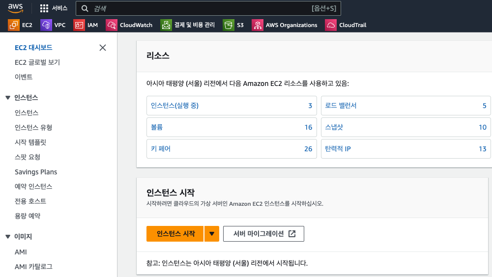
2. AMI 선택
   1. 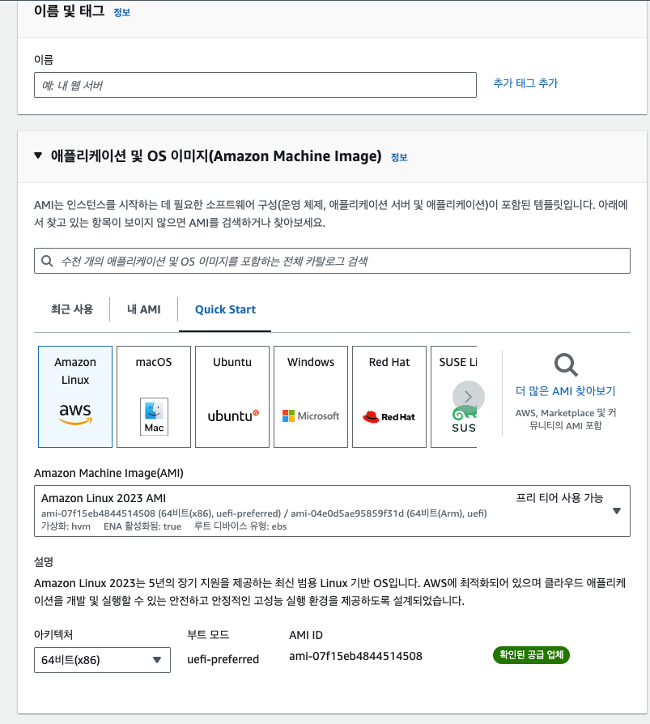
3. 인스턴스 유형 선택
   1. 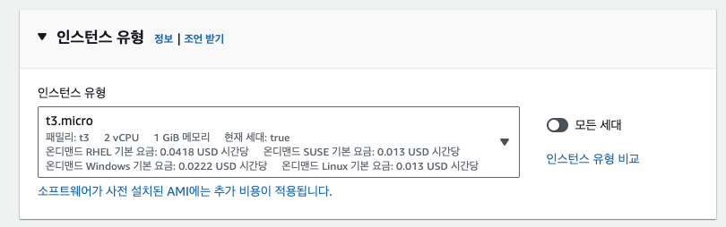
4. 키 페어 생성 또는 선택
   1. 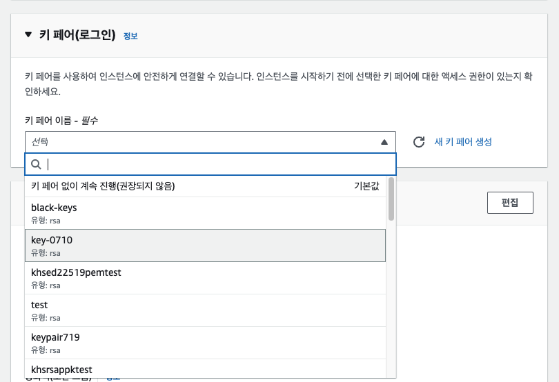
   2. 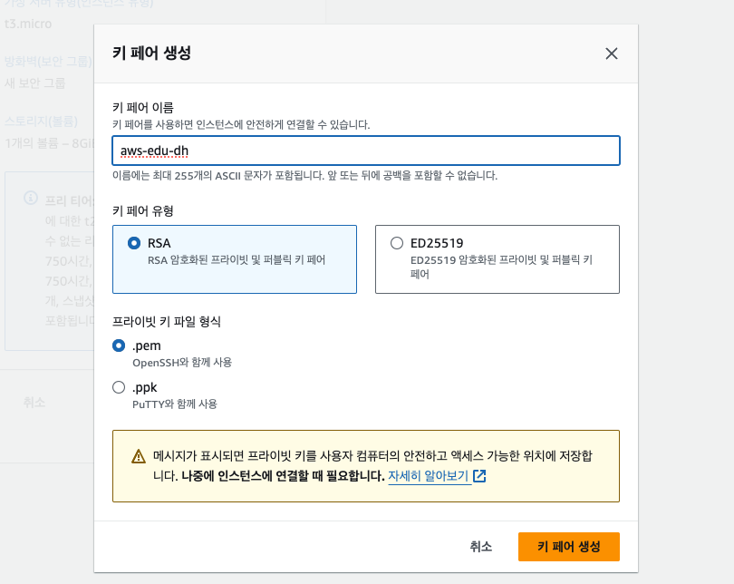
5. 네트워크 설정 - 이 부분은 갖춰진 것으로 전제
6. 시작.
   1. 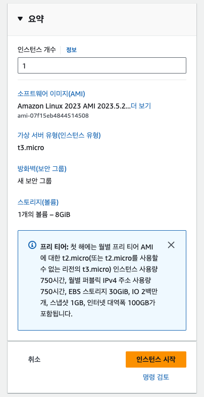
7. 끝마치며.
   1. 콘솔에서는 VPC 내 서브넷이 있다면 기본적으로 선택되어지고 인스턴스가 생성될 때 자동으로 보안그룹과 허용 규칙을 설정해 준다.


### 2. AWS CLI

순서는 이렇다.

1. CLI 설치

   1. ```
      curl 명령을 사용하여 파일을 다운로드
      curl "https://awscli.amazonaws.com/AWSCLIV2.pkg" -o "AWSCLIV2.pkg"
      
      다운로드한 .pkg 파일을 소스로 지정하여 표준 macOS installer 프로그램을 실행
      sudo installer -pkg AWSCLIV2.pkg -target /
      ```

   2. 조회

      1. 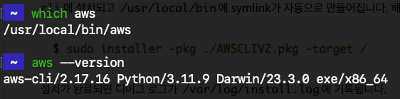

2. configure 등록

   1. aws configure list 로 조회해본다.
      1. 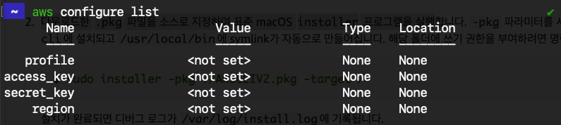
   2. aws configure 로 등록한다.
      1. 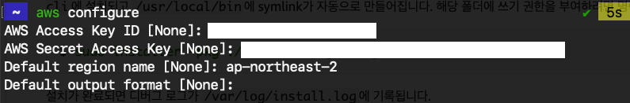
   3. aws credentials 로 등록도 가능하다 

3. EC2 생성

   1. 키 페이를 생성한다. - 읽기 권한 400 추천 - doc 참고
      1. 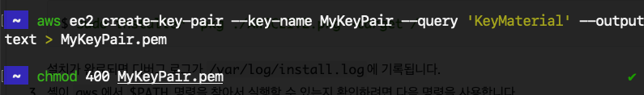
   2. 키 페어를 조회해본다.
      1. 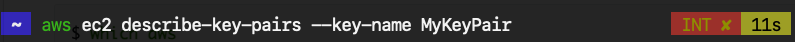
      2. 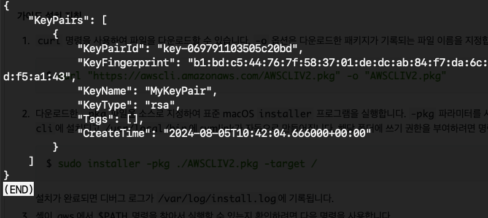

3. 보안 그룹을 생성한다. -> 조회 (미리 VPC 있다고 전제) - 규칙 넣은 이후라 조회 사진이 좀 다를 수 있음. 

   1. 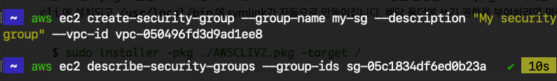

   2. 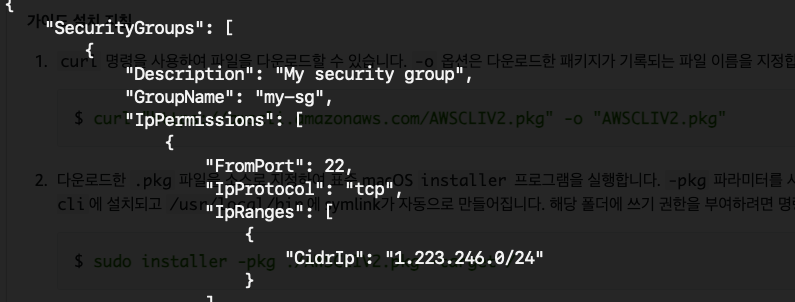

4. 보안 그룹 규칙을 생성해 준다. 

 	1. 규칙 전에 CIDR 을 가져오고 해당 포트로 3339 / 22 (ssh) 를 허용해준다.
          	1. 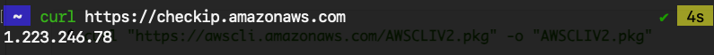
              	2. CIDR 블록으로 / 뒤에 숫자를 붙여준다. 개념은 알아서 공부해보기
              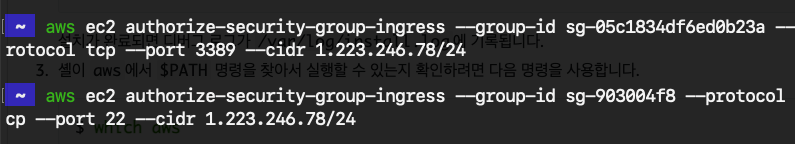
                  	4. 아까와 같은 명령어로 조회해보면 위 사진처럼 22포트가 들어간다.
      
 	2. 기존에 있던 VPC id 와 subnet Id 를 통해 인스턴스를 시작하면된다.
          	1.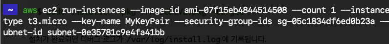
               	2. 태그도 달아서 확인해보자
                        	1. 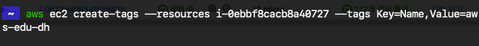
                              	3. 콘솔에서 확인하면 이렇게 나온다.
                     	1. 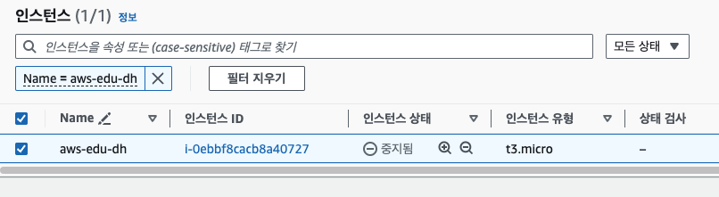